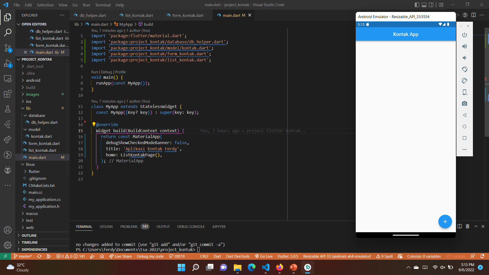
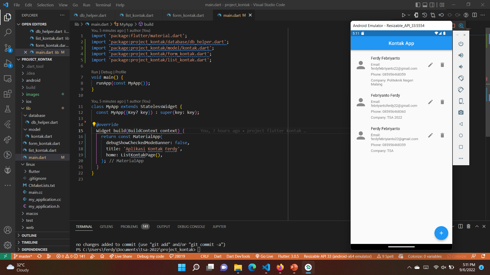
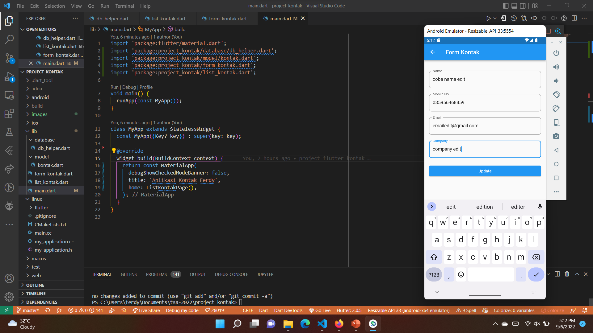
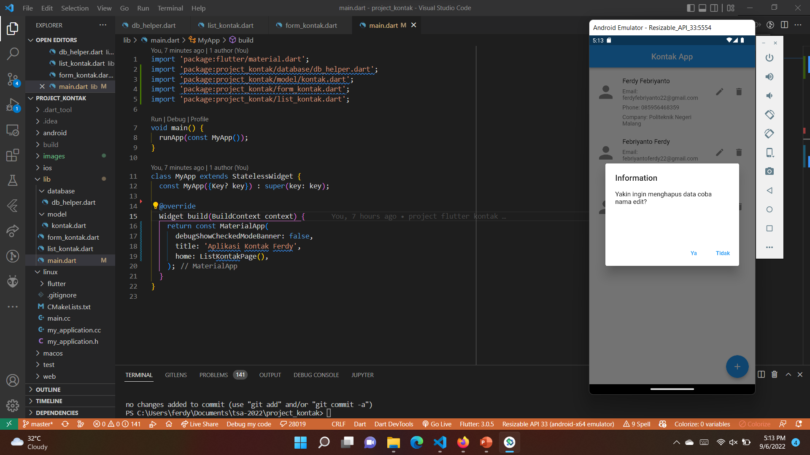

# #23 | Project Contact

## Tujuan Praktikum

* Mampu memasang dan memanfaatkan plugin SQFlite
* Membuat aplikasi dengan koneksi database SQLite
* Mampu menerapkan operasi create, read, update dan delete (CRUD)

## Aplikasi CRUD Studi Kasus Data Kontak

* Aplikasi bisa melihat (listing) daftar kontak
* Aplikasi bisa tambah, edit, dan delete kontak
* Terdapat database dengan satu tabel yang berisikan data id, nama, nomor kontak, email, dan nama perusahaan

 

# Hasil Praktikum

## Tampilan Aplikasi Keadaan Kosong

* Pada tampilan awal aplikasi, terdapat tombol tambah kontak dan list kontak yang kosong

## Tampilan Aplikasi Menambahkan Kontak

* Pada tampilan ini, terdapat form tambah kontak yang berisi nama, nomor kontak, email, dan nama perusahaan

## Tampilan Aplikasi Setelah Menambahkan Kontak

* Pada tampilan ini, terdapat list kontak yang sudah terisi

## Tampilan Aplikasi Edit Kontak

* Pada tampilan ini, terdapat form edit kontak yang berisi nama, nomor kontak, email, dan nama perusahaan

## Tampilan Aplikasi Menghapus Kontak

* Pada tampilan ini, terdapat list kontak yang sudah terisi dan tombol hapus

